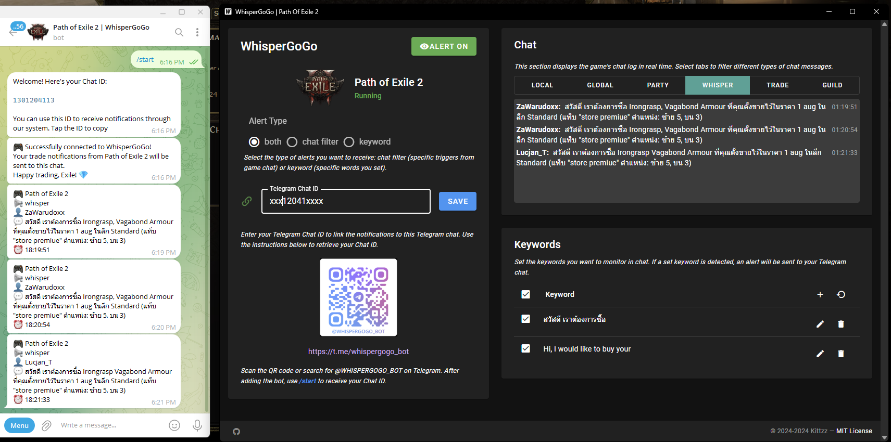

# WhisperGoGo

WhisperGoGo is a notification tool that forwards Path of Exile 2 chat messages to Telegram.

WhisperGoGo เป็นเครื่องมือแจ้งเตือนที่ส่งต่อข้อความแชทจากเกม Path of Exile 2 ไปยัง Telegram

## Features / คุณสมบัติ

- Monitor Path of Exile 2 chat / ตรวจสอบแชทในเกม Path of Exile 2
- Send notifications to Telegram / ส่งการแจ้งเตือนไปยัง Telegram
- Keyword filtering / กรองคำสำคัญ
- Support for multiple chat types (whisper, trade, etc.) / รองรับประเภทแชทหลายแบบ (ข้อความส่วนตัว, การค้า ฯลฯ)

## Installation / การติดตั้ง

1. Download the latest release from the [Releases page](https://github.com/kittizz/poe2-whispergogo/releases)
2. Extract the zip file to your desired location

1. ดาวน์โหลดเวอร์ชันล่าสุดจาก [หน้า Releases](https://github.com/kittizz/poe2-whispergogo/releases)
2. แตกไฟล์ zip ไปยังตำแหน่งที่ต้องการ

## Usage / วิธีใช้งาน

1. Run WhisperGoGo.exe
2. Scan the QR code or search for @WHISPERGOGO_BOT on Telegram
3. Start the bot type /start and get your Chat ID
4. Enter your Telegram Chat ID in the WhisperGoGo application
5. Set your desired alert types and keywords
6. Click "ALERT ON" to start monitoring

1. เปิดโปรแกรม WhisperGoGo.exe
2. สแกน QR code หรือค้นหา @WHISPERGOGO_BOT บน Telegram
3. เริ่มต้นใช้งานบอทพิมพ์ /start และรับ Chat ID ของคุณ
4. ใส่ Telegram Chat ID ในแอปพลิเคชัน WhisperGoGo
5. ตั้งค่าประเภทการแจ้งเตือนและคำสำคัญที่ต้องการ
6. คลิก "ALERT ON" เพื่อเริ่มการตรวจสอบ

## Support / การสนับสนุน

For issues or feature requests, please open an issue on the [GitHub repository](https://github.com/kittizz/poe2-whispergogo/issues).

สำหรับปัญหาหรือคำขอคุณสมบัติใหม่ กรุณาเปิด issue บน [GitHub repository](https://github.com/kittizz/poe2-whispergogo/issues)

## License / ลิขสิทธิ์

This project is licensed under the MIT License - see the [LICENSE](LICENSE) file for details.

โครงการนี้ได้รับอนุญาตภายใต้ MIT License - ดูรายละเอียดได้ที่ไฟล์ [LICENSE](LICENSE)